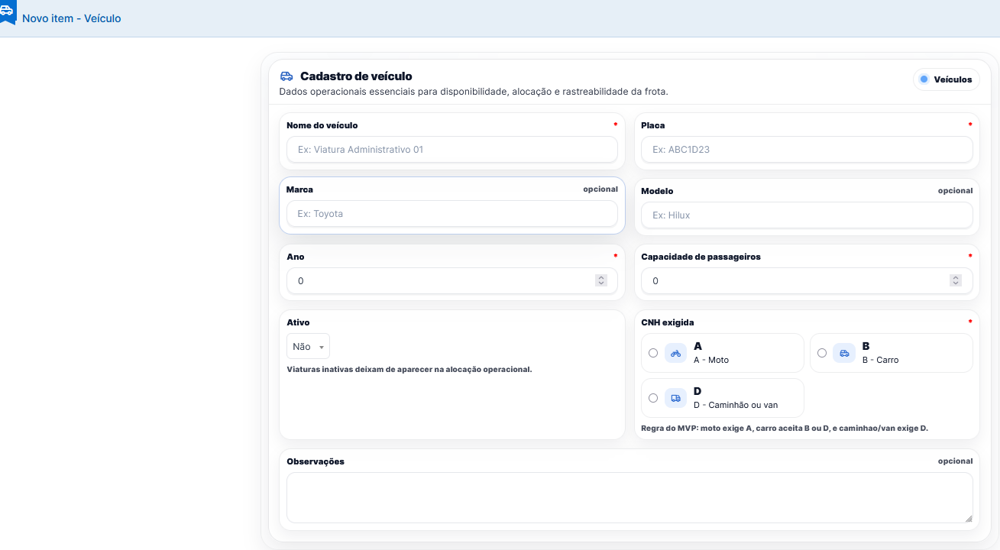
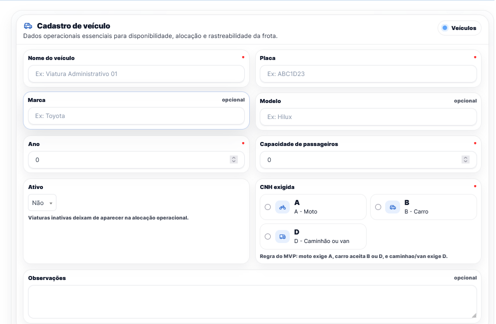
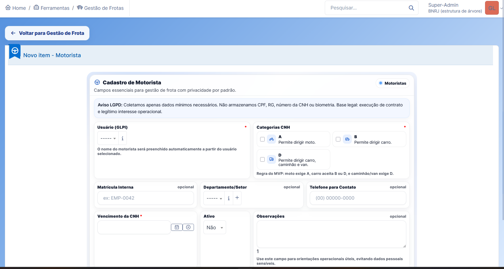
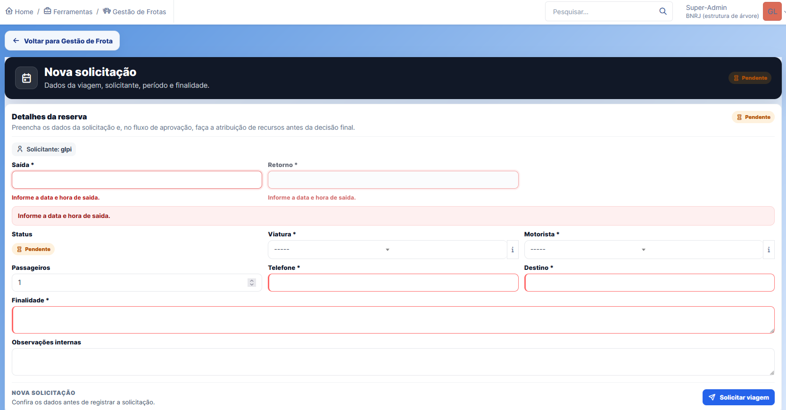
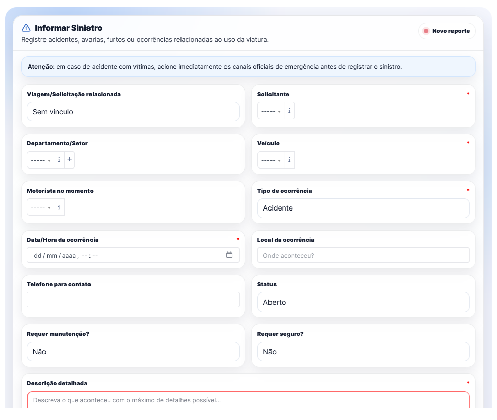

# SisViaturas

Fleet management and vehicle scheduling plugin for **GLPI 11**.

> [!WARNING]
> **This plugin is under active development.**
> The codebase, screens, data model, translations, CSS structure, and maintenance module are changing frequently. Do not treat the current branch as a stable production release without prior validation.

**SisViaturas** (`vehiclescheduler`) supports vehicle reservation requests, approval flow, operational assignment, conflict validation, and dashboard visibility for day-to-day fleet operations.

## Screenshots











## Current MVP Scope

- vehicle CRUD
- driver CRUD
- reservation/request workflow
- dashboard

Additional operational modules may be present or evolving, including maintenance, incidents, reports, checklists, fines, insurance claims, and theme/UI helpers.

## Maintenance Module Direction

The maintenance module is being scoped around a simple operational MVP:

- service orders linked to existing vehicles
- simple workshop registry for own and accredited workshops
- workshop specialties used as an auxiliary filter
- estimated and final maintenance costs recorded on the service order
- essential flow from opening, analysis, workshop assignment, diagnosis/budget, approval, execution, conclusion, and vehicle release

Contract control for accredited workshops is planned for a future phase. The MVP does not manage contract balances, contract consumption by service order, contract managers, or administrative/technical inspectors.

See [docs/modulo_manutencao_viaturas_markdown.md](docs/modulo_manutencao_viaturas_markdown.md) for the maintenance module specification.

## Documentation

- [INSTALL.md](INSTALL.md): installation, update, GLPI activation, and Apache deployment
- [INSTALL_pt-BR.md](INSTALL_pt-BR.md): Brazilian Portuguese installation guide
- [INSTALL_fr.md](INSTALL_fr.md): French installation guide
- [INSTALL_es.md](INSTALL_es.md): Spanish installation guide
- [README_vehiclescheduler_pt-BR.md](README_vehiclescheduler_pt-BR.md): Brazilian Portuguese README
- [README_vehiclescheduler_fr.md](README_vehiclescheduler_fr.md): French README
- [README_vehiclescheduler_es.md](README_vehiclescheduler_es.md): Spanish README
- [CHANGELOG.md](CHANGELOG.md): release history and notable changes
- [CHANGELOG_pt-BR.md](CHANGELOG_pt-BR.md): Brazilian Portuguese changelog
- [CHANGELOG_fr.md](CHANGELOG_fr.md): French changelog
- [CHANGELOG_es.md](CHANGELOG_es.md): Spanish changelog
- [AGENTS.md](AGENTS.md): normative rules for AI/code generation
- [CODEX_HANDOFF.md](CODEX_HANDOFF.md): practical implementation guidance for Codex

## Requirements

- GLPI 11 installed and working
- PHP 8.1 or newer
- Composer
- Apache or another web server configured for GLPI

## Quick Install

```bash
cd /var/www/glpi/plugins
git clone https://github.com/GeneralVini/vehiclescheduler.git vehiclescheduler
cd vehiclescheduler
composer install
```

Then open GLPI, go to **Setup > Plugins**, install **SisViaturas / Vehicle Scheduler**, and enable it.

For Apache examples and full setup steps, see [INSTALL.md](INSTALL.md).

## Technical Direction

The project follows a strict split between business logic and UI rendering:

- `src/`: preferred location for new/refactored backend and domain code
- `front/`: thin PHP entry points and page rendering
- `ajax/`: thin async endpoints
- `public/css/`: styling
- `public/js/`: client behavior
- `locales/`: translations
- `inc/`: legacy-compatible classes while migration occurs

Backend/domain classes must not contain screen layout, inline CSS, inline JavaScript, page composition, or button markup.

## Apache Deployment Modes

The repository includes two Apache examples. Keep only one active in the server Apache configuration directory:

- [glpi-root.conf.example](glpi-root.conf.example): GLPI at `http://server/`
- [glpi-subdir.conf.example](glpi-subdir.conf.example): GLPI at `http://server/glpi/`

Plugin URLs must rely on GLPI-aware helpers instead of hardcoded assumptions about `/glpi`.

## License and Attribution

SisViaturas / Vehiclescheduler is licensed under the [PolyForm Noncommercial License 1.0.0](LICENSE).

The project is maintained by Vinicius Lopes (`generalvini@gmail.com`, Telegram `@ViniciusHonorato`) and originated as a fork of work by Telegram user `@mendesmarcio`. Attribution to both must be preserved in forks, redistributions, and derivative works. Commercial use is not permitted without prior written permission from Vinicius Lopes.

See [NOTICE](NOTICE) for required attribution notices.
