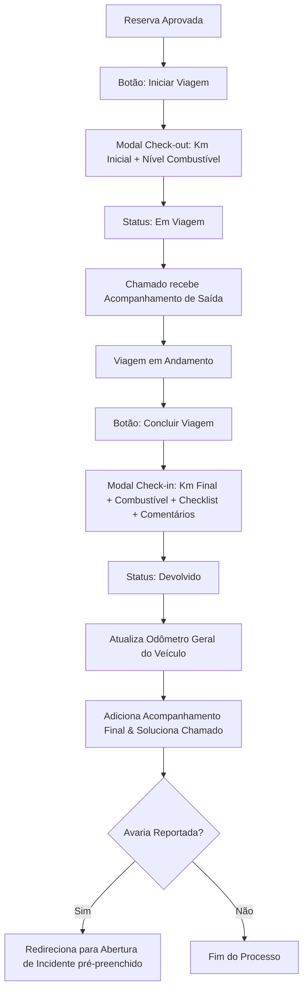

# Manual de Integrações e Fluxo de Viagem

Este documento descreve a arquitetura de integrações nativas com chamados do GLPI, validações lógicas de datas e o fluxo de devolução de veículos implementados no plugin **Vehicle Scheduler**.

---

## 1. Dicionário de Dados (Novas Colunas)

Para suportar estas integrações, as seguintes alterações foram feitas no banco de dados do GLPI:

| Tabela | Coluna | Tipo | Descrição |
| :--- | :--- | :--- | :--- |
| `glpi_plugin_vehiclescheduler_vehicles` | `mileage` | `INT` | Odômetro atualizado acumulado do veículo. |
| `glpi_plugin_vehiclescheduler_schedules` | `real_begin_date` | `TIMESTAMP` | Data/hora real da retirada da chave (Check-out). |
| | `real_end_date` | `TIMESTAMP` | Data/hora real da devolução do veículo (Check-in). |
| | `initial_mileage` | `INT` | Odômetro registrado no início da viagem. |
| | `final_mileage` | `INT` | Odômetro registrado na devolução do veículo. |
| | `initial_fuel` | `INT` | Nível de combustível inicial (1 a 4). |
| | `final_fuel` | `INT` | Nível de combustível final (1 a 4). |
| | `return_checklist` | `TEXT` (JSON) | Checklist de limpeza e avarias no check-in. |
| | `return_comment` | `TEXT` | Observações gerais anotadas na devolução. |
| `glpi_plugin_vehiclescheduler_incidents` | `tickets_id` | `INT` | ID do chamado associado ao incidente no GLPI. |
| `glpi_plugin_vehiclescheduler_maintenances` | `tickets_id` | `INT` | ID do chamado de requisição da manutenção preventiva. |
| `glpi_plugin_vehiclescheduler_driverfines` | `tickets_id` | `INT` | ID do chamado de notificação de multa no GLPI. |
| `glpi_plugin_vehiclescheduler_drivers` | `users_id` | `INT` | ID do usuário correspondente no GLPI. |

---

## 2. Fluxo de Integração de Chamados (Ticketing)

### A. Solicitação e Aprovação de Motoristas
1. **Cadastro Pendente**: Quando um colaborador solicita acesso como motorista pelo portal simplificado, o plugin cria o registro com status `is_approved = 0` e abre um chamado no GLPI com o título `Solicitação de Cadastro de Motorista: [Nome]`. O chamado contém os dados enviados (CNH, Categoria, Telefone) e o link direto para aprovação.
2. **Aprovação**: Ao alterar o status do motorista para aprovado (`is_approved = 1`), o plugin intercepta a alteração e **soluciona o chamado automaticamente**, inserindo a mensagem de que o acesso foi liberado.

### B. Registro de Incidentes
1. **Abertura**: Ao relatar um incidente de percurso, um chamado do tipo Incidente é criado no GLPI sob a responsabilidade do condutor.
2. **Sincronização de Status**: A alteração de status no incidente reflete no chamado correspondente:
   - *Aberto* $\rightarrow$ Novo (`INCOMING`)
   - *Em Análise* $\rightarrow$ Atribuído (`ASSIGNED`) + Acompanhamento explicativo
   - *Resolvido* $\rightarrow$ Solucionado (`SOLVED`) + Acompanhamento descritivo
   - *Fechado* $\rightarrow$ Fechado (`CLOSED`)

### C. Manutenções
* **Manutenção Corretiva (vinculada a Incidente):**
  - Não cria um novo chamado. Em vez disso, localiza o chamado do incidente original e cria uma **Tarefa (`TicketTask`)** planejada informando oficina, data de agendamento e custo estimado.
  - Ao concluir a manutenção, a tarefa correspondente é marcada como Concluída (`state = 2`) e um **Acompanhamento (`ITILFollowup`)** detalha o término e os custos reais.
* **Manutenção Preventiva:**
  - Cria um novo chamado de Requisição no GLPI em nome do gestor.
  - Sincroniza o andamento da manutenção com os status do chamado: Agendada $\rightarrow$ Novo, Em Andamento $\rightarrow$ Atribuído, Concluída $\rightarrow$ Solucionado, Cancelada $\rightarrow$ Fechado.

### D. Multas de Trânsito
- Ao registrar uma multa, o sistema busca se o motorista infrator tem um usuário GLPI vinculado.
- Em caso positivo, abre um chamado de notificação **em nome do motorista** (`_users_id_requester`), garantindo alertas e envios de e-mails automáticos do GLPI para o condutor.
- Alterações no status da multa (ex: Paga, Recurso) geram acompanhamentos automáticos no chamado.

---

## 3. Fluxo de Viagem (Check-out / Check-in)

O fluxo de uso do veículo pelo motorista designado opera em etapas na tela de visualização do agendamento:

---

## 4. Regras Lógicas e Validação de Datas

Para evitar inconsistências operacionais e dados errôneos, as seguintes regras foram implementadas tanto no **Backend (PHP)** quanto na **Interface (Flatpickr/JS)**:

1. **Reservas (Schedules):**
   - A data de saída não pode ser no passado.
   - A data de retorno não pode ser anterior à data de saída.
   - No frontend, ao selecionar a data de saída, o calendário da data de retorno automaticamente ajusta sua data mínima para corresponder à saída.
2. **Manutenções (Maintenances):**
   - A data agendada não pode ser no passado.
   - A data de conclusão não pode ser inferior à data agendada.
